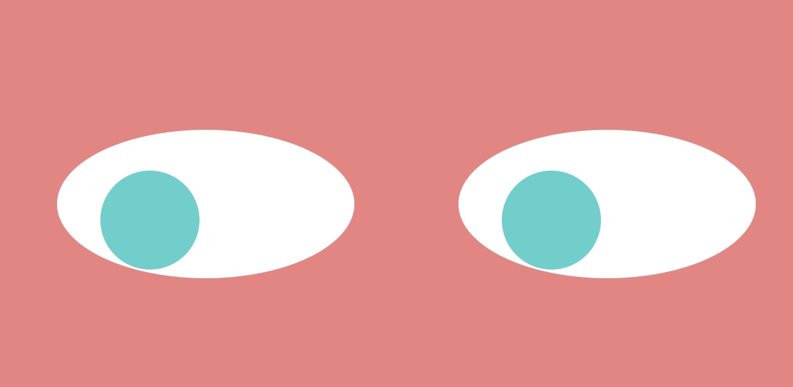

**Proyecto Eyeball**

**Descripción:** Este proyecto consistía en tomar un código original con un globo ocular que pudiera seguir los movimientos del mouse para incluir dos globos oculares que pudieran seguir los movimientos del mouse. Ya, he actualizado el código css para cambiar el fondo y el color de la pupila.

**Mejoras futuras:** En el futuro, se podrían hacer mejoras para tener objetos en el fondo para que los ojos apunten o se podría hacer un estilo adicional para incluir una nariz y una boca para que la imagen se parezca más a una persona. El primer paso que daré es agregar una nariz y actualizar el estilo de fondo.

**Ejecutando el código:** Para utilizar este código, debe abrir el archivo html y mover el mouse para ver cómo los ojos siguen los movimientos del mouse.
